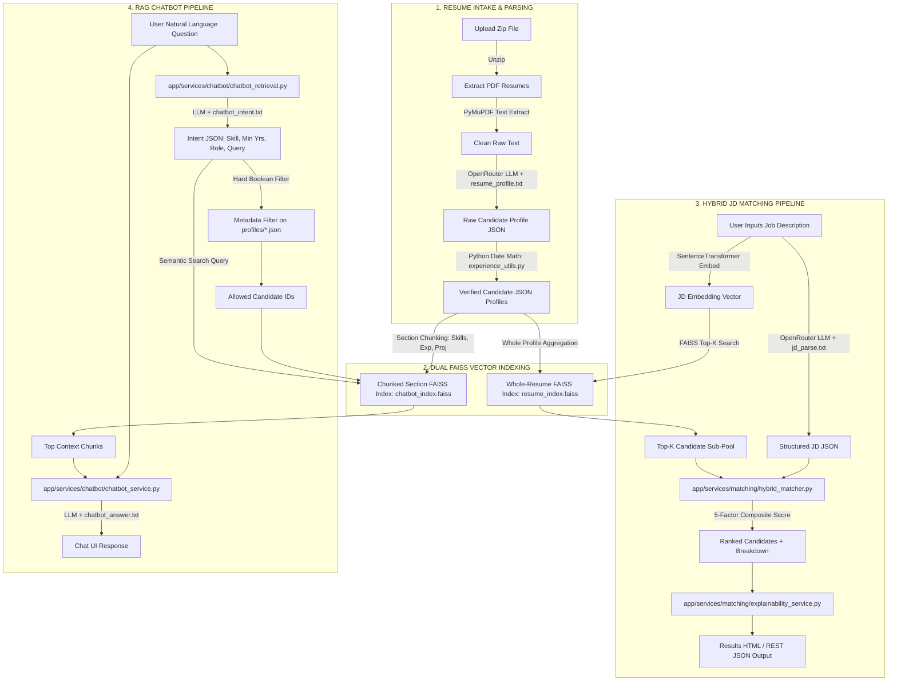
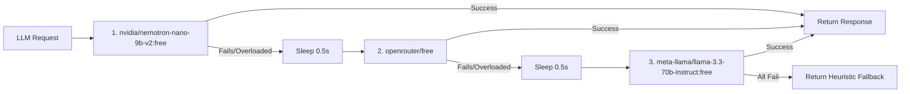

# RecruitAI — Ultimate Interview Study Guide & Technical Architecture Blueprint

> 📌 **What is this guide?**  
> A comprehensive, beginner-friendly yet technically deep breakdown of the entire **RecruitAI** codebase. Designed specifically to help you explain every architectural decision, machine learning algorithm, and backend framework pattern during technical interviews.

---

## 🧭 Executive Sitemap: How the Project Works (In 60 Seconds)

Imagine you are a technical recruiter receiving 100 resume PDFs in a `.zip` file:
1. **Intake & Parsing:** RecruitAI extracts raw text from PDFs using **PyMuPDF**, sends it to an LLM via **OpenRouter** to convert it into structured JSON (skills, experience, projects), and calculates real experience using deterministic **Python date math** (not trusting LLM math).
2. **Vector Indexing:** It builds **two separate vector indexes** using **Sentence-Transformers** (`all-MiniLM-L6-v2`) and **FAISS**:
   - *Index 1 (Whole Resumes):* Used for macro Job Description (JD) matching.
   - *Index 2 (Section Chunks):* Used for micro section retrieval in the Chatbot.
3. **Hybrid JD Matcher:** When a user pastes a Job Description, FAISS retrieves the Top-K candidate resumes. Then a **5-Factor Hybrid Scoring Engine** reranks them based on semantic similarity (25%), weighted skill matching (35%), experience verification (20%), project relevance (10%), and domain keywords (10%), generating an explainable report for each candidate.
4. **RAG Candidate Pool Chatbot:** When a recruiter asks *"Who knows Python and has 2+ years experience?"*, an LLM extracts the structured intent, Python runs strict metadata boolean filtering, FAISS executes semantic search on the filtered subset, and the LLM generates a grounded natural-language answer.

---

## 🗺️ Master System Flowchart



---

## 🏛️ Section 1: FastAPI & Backend Architecture (⭐ Key Interview Focus)

### 1.1 Modular Package Directory Layout (`app/`)
RecruitAI is structured following enterprise FastAPI best practices:

```text
RecruitAI/
├── run.py                          # Application launcher script
├── app/                            # Core application package
│   ├── main.py                     # App instance, CORS, static mounts, router setup
│   ├── core/
│   │   └── config.py               # Settings, directory paths, .env loading
│   ├── api/
│   │   └── routes/                 # Router submodules
│   │       ├── __init__.py         # Router aggregation
│   │       ├── upload.py           # POST /upload-zip
│   │       ├── match.py            # GET /, GET /jd-match, POST /match, POST /match-ui
│   │       └── chat.py             # GET /chat, POST /chat-api, POST /chat-reset
│   ├── services/                   # Pure business logic submodules
│   │   ├── upload/                 # Zip extraction, PDF batch processing
│   │   ├── parser/                 # Resume LLM extraction, JD parsing, date math
│   │   ├── vectorstore/            # Whole-resume FAISS index builder
│   │   ├── matching/               # Hybrid matcher, skill normalizer, explainability
│   │   └── chatbot/                # RAG retrieval, chunk indexer, QA service
│   ├── schemas/                    # Pydantic input/output schemas
│   │   ├── match.py                # Match request/response models
│   │   └── chat.py                 # Chat response models
│   └── prompts/                    # Externalized prompt templates
│       ├── __init__.py             # Template loader with lru_cache
│       ├── resume_profile.txt      # Resume extraction prompt
│       ├── jd_parse.txt            # JD parsing prompt
│       ├── chatbot_intent.txt      # Intent extraction prompt
│       └── chatbot_answer.txt      # RAG answer prompt
├── templates/                      # Jinja2 HTML pages
├── static/                         # CSS stylesheets & JS interactive scripts
├── uploads/                        # Raw uploaded zip & resume PDFs (gitignored)
├── profiles/                       # Parsed candidate profile JSON files (gitignored)
└── faiss_db/                       # Generated FAISS binary vector stores (gitignored)
```

---

### 1.2 Core Backend Design Concepts & Interview Highlights

#### Concept A: Dynamic Path Anchoring (`app/core/config.py`)
- **Problem:** Running Python scripts from different working directories (e.g., `python run.py` vs `python app/main.py`) causes relative file paths to break.
- **Solution:** RecruitAI anchors all directory paths dynamically to the project root using Python's `pathlib.Path`:
  ```python
  BASE_DIR = Path(__file__).resolve().parent.parent.parent
  UPLOADS_DIR = BASE_DIR / "uploads"
  PROFILES_DIR = BASE_DIR / "profiles"
  FAISS_DB_DIR = BASE_DIR / "faiss_db"
  ```
- **Interview Takeaway:** Explaining dynamic path anchoring demonstrates production mindset and cross-platform OS portability awareness.

#### Concept B: APIRouter Aggregation (`app/api/routes/`)
- **Pattern:** Routes are divided into isolated, domain-specific sub-routers (`upload.py`, `match.py`, `chat.py`).
- **Aggregation:** `app/api/routes/__init__.py` collects all sub-routers into a unified `api_router`:
  ```python
  api_router = APIRouter()
  api_router.include_router(match_router)
  api_router.include_router(upload_router)
  api_router.include_router(chat_router)
  ```
- **Main Assembly:** `app/main.py` simply mounts `api_router`. This ensures zero route clutter in the main application file.

#### Concept C: Dual-Route Pattern (HTML Templates vs REST JSON APIs)
- To support both rich browser interaction and programmatic backend integration, endpoints are mirrored:
  - `POST /match-ui`: Accepts form inputs (`Form(...)`), runs matching, and renders Jinja2 template `results.html`.
  - `POST /match`: Accepts form inputs, runs matching, and returns a structured JSON payload conforming to Pydantic schema `MatchAPIResponse`.

#### Concept D: Pydantic Data Schemas (`app/schemas/`)
- **Validation & Serialization:** Pydantic models (e.g., `CandidateResult`, `ScoreBreakdown`, `ChatResponse`) enforce field data types (floats, lists, strings) and handle response serialization.
- **Auto Documentation:** FastAPI inspects these Pydantic models to automatically auto-generate interactive Swagger API documentation at `/docs`.

#### Concept E: Central Prompt Engine with `@lru_cache` (`app/prompts/`)
- **Externalization:** Prompts are stored in `.txt` files rather than hardcoded in Python strings.
- **Performance:** `load_prompt(name: str)` uses `@lru_cache(maxsize=None)` to read from disk once and cache prompt templates in memory:
  ```python
  @lru_cache(maxsize=None)
  def load_prompt(name: str) -> str:
      filepath = PROMPTS_DIR / f"{name}.txt"
      return filepath.read_text(encoding="utf-8")
  ```

---

## 🤖 Section 2: Machine Learning, Vector Search & AI Concepts

### 2.1 Sentence Transformers & Dense Embeddings
- **Model:** `sentence-transformers/all-MiniLM-L6-v2`
- **Embedding Space:** Maps text into a **384-dimensional dense vector space** ($d = 384$).
- **Role:** Converts free-form text (resumes, job descriptions, chat questions) into numerical vectors where semantically similar concepts lie close together in Euclidean space.

---

### 2.2 FAISS (Facebook AI Similarity Search) & Cosine Similarity

#### How Cosine Similarity Works:
Cosine similarity measures the angle between two vectors $\vec{u}$ and $\vec{v}$:

$$\text{Cosine Similarity}(\vec{u}, \vec{v}) = \frac{\vec{u} \cdot \vec{v}}{\|\vec{u}\| \|\vec{v}\|}$$

#### Why `IndexFlatIP` Achieves Cosine Similarity:
FAISS provides an Inner Product index (`IndexFlatIP`), which computes raw dot products ($\vec{u} \cdot \vec{v}$).  
Before inserting or searching vectors in FAISS, RecruitAI executes **L2 Normalization**:

```python
faiss.normalize_L2(embeddings)
```

When vectors are normalized to unit length ($\|\vec{u}\| = 1$ and $\|\vec{v}\| = 1$):

$$\text{Inner Product} = \vec{u} \cdot \vec{v} = \frac{\vec{u} \cdot \vec{v}}{1 \times 1} = \text{Cosine Similarity}(\vec{u}, \vec{v})$$

> 💡 **Interview Trick Question:** *"Does FAISS support Cosine Similarity out of the box?"*  
> **Answer:** FAISS `IndexFlatIP` computes dot products. When embeddings are L2-normalized first, inner product is mathematically identical to cosine similarity!

---

### 2.3 Dual-Index Strategy: Why Two Vector Stores?

RecruitAI builds **two separate FAISS vector stores**:

```text
               Candidate JSON Profiles
                         │
        ┌────────────────┴────────────────┐
        ▼                                 ▼
Whole-Resume Concatenation        Section-Level Chunking
(Name + Skills + Experience)     (Skills, Project, Exp)
        │                                 │
        ▼                                 ▼
faiss_db/resume_index.faiss       faiss_db/chatbot_index.faiss
(1 Vector / Candidate)            (N Vectors / Candidate)
        │                                 │
        ▼                                 ▼
   JD Matcher                        Chatbot RAG
```

- **Index 1 (`resume_index.faiss`):** 1 vector per candidate. Represents the entire candidate profile for holistic Job Description matching.
- **Index 2 (`chatbot_index.faiss`):** Multiple chunk vectors per candidate (summary, skills, specific project, specific job). Used by the chatbot so that fine-grained questions (e.g. *"Tell me about Python projects"*) match specific sections without dilution.

---

### 2.4 OpenRouter Multi-Model Fallback Chain
To protect against rate limits (HTTP 429), server overloads (HTTP 503), or API key quota depletion, LLM requests loop through a priority chain of models:



---

## ⚙️ Section 3: Subsystems & Algorithmic Deep-Dive

### 3.1 PDF Extraction & Deterministic Date Verification

#### 1. PDF Parsing:
`pymupdf` (`fitz`) extracts raw text from PDF files, strips empty lines, and truncates to 3,500 characters to fit LLM token windows cleanly.

#### 2. Deterministic Experience Date Arithmetic (`app/services/parser/experience_utils.py`):
LLMs are notorious for failing at date math (e.g., calculating `"Jan 2021 to March 2024"` as 5 years). RecruitAI implements **deterministic Python arithmetic**:

$$\text{Months} = (Y_{\text{end}} - Y_{\text{start}}) \times 12 + (M_{\text{end}} - M_{\text{start}}) + 1$$

- Handles active roles (`"Present"`, `"Current"`, `"Ongoing"` $\implies$ sets end date to current month).
- Sums months across all verified roles and converts to years: $\text{Years} = \text{round}(\frac{\text{Total Months}}{12}, 1)$.
- If dates are valid, sets `experience_years_verified = True`. If unparseable, falls back safely to the self-reported LLM estimate.

---

### 3.2 Skill Synonym Normalizer (`app/services/matching/skill_normalizer.py`)

Contains **80+ canonical technology mappings**:

| Input Skill Variants | Canonical Skill Output |
|---|---|
| `postgres`, `postgresql`, `postgres db` | **PostgreSQL** |
| `js`, `javascript`, `ecmascript` | **JavaScript** |
| `k8s`, `kubernetes` | **Kubernetes** |
| `py`, `python3`, `python` | **Python** |
| `rest`, `restful`, `rest api` | **REST API** |
| `ml`, `machine learning` | **Machine Learning** |

#### Skill Matching Formula:
Evaluates canonical required ($R$) and preferred ($P$) skills against candidate skills ($C$):

$$\text{Weighted Skill Score} = \begin{cases} 
(0.70 \times \frac{|C \cap R|}{|R|}) + (0.30 \times \frac{|C \cap P|}{|P|}), & \text{if } R \text{ and } P \text{ exist} \\
1.00 \times \frac{|C \cap R|}{|R|}, & \text{if only } R \text{ exists} \\
1.00 \times \frac{|C \cap P|}{|P|}, & \text{if only } P \text{ exists}
\end{cases}$$

---

### 3.3 Multi-Factor Hybrid Scoring Engine (`app/services/matching/hybrid_matcher.py`)

RecruitAI computes a **5-Factor Composite Score** ($0.0$ to $100.0$):

$$\text{Composite Score} = (0.25 \times S_{\text{sem}}) + (0.35 \times S_{\text{skill}}) + (0.20 \times S_{\text{exp}}) + (0.10 \times S_{\text{proj}}) + (0.10 \times S_{\text{kw}})$$

```text
    ┌─────────────────────────────────────────────────────────────┐
    │                5-FACTOR COMPOSITE SCORE                     │
    └─────────────────────────────────────────────────────────────┘
          │              │             │            │          │
          ▼              ▼             ▼            ▼          ▼
     Semantic (25%)  Skills (35%)   Exp (20%)   Proj (10%)   Kw (10%)
     FAISS Cosine    Synonym        Date Math   Tech Overlap Text Search
     Vector Score    Weighted Score Match Ratio in Projects  Coverage
```

#### Detailed Breakdown of the 5 Sub-Scores:

1. **Semantic Vector Score ($S_{\text{sem}}$ — 25%):** FAISS cosine similarity between raw JD text and whole-resume text.
2. **Weighted Skill Score ($S_{\text{skill}}$ — 35%):** Normalized required/preferred skill ratio from `skill_normalizer.py`.
3. **Experience Verification Score ($S_{\text{exp}}$ — 20%):**
   $$S_{\text{exp}} = \begin{cases} 
   100.0, & \text{if Candidate Exp} \ge \text{Min Required Exp (or Min Exp} \le 0) \\
   \max\left(25.0, \frac{\text{Candidate Exp}}{\text{Min Required Exp}} \times 100.0\right), & \text{otherwise}
   \end{cases}$$
4. **Project Relevance Score ($S_{\text{proj}}$ — 10%):** Overlap between candidate project technology tags/descriptions and JD domain keywords.
5. **Keyword Coverage Score ($S_{\text{kw}}$ — 10%):** Percentage of domain keywords present anywhere in the candidate's experience text.

---

### 3.4 Recruiter Insights & Explainability Generator (`explainability_service.py`)

Produces human-readable insights for each ranked candidate:
- **Matched Skills:** Combined list of matched required and preferred skills.
- **Missing Skills:** List of missing requirements.
- **Strengths:** Bullet points highlighting experience surplus, exact skill matches, or direct role alignment.
- **Weaknesses:** Bullet points detailing experience deficits or missing core skills.
- **Explanation:** Synthesized summary statement (e.g., *"Candidate is ranked as a High-priority match with a 84.5% composite hybrid score. 4/4 required skills matched..."*).

---

### 3.5 RAG Chatbot Intent Extraction & Filtering Pipeline (`chatbot_retrieval.py`)

When a user asks: *"Who has 3+ years experience and knows PostgreSQL?"*

```text
User Question ──► LLM Intent Extractor ──► Intent JSON
                                             │
                       ┌─────────────────────┴─────────────────────┐
                       ▼                                           ▼
             Hard Metadata Filter                       Semantic Search Query
             (min_years=3, skill='PostgreSQL')          ("PostgreSQL database skills")
                       │                                           │
                       ▼                                           ▼
             Filtered Candidate IDs                     FAISS Vector Search
             (e.g., [cand_01, cand_04])                 (Restricted to ID pool)
                       │                                           │
                       └─────────────────────┬─────────────────────┘
                                             ▼
                                  Retrieved Context Chunks
                                             │
                                             ▼
                                  LLM Grounded Answer Generation
```

1. **Intent Extraction:** LLM converts the user's question into structured JSON:
   ```json
   {
     "skill": "PostgreSQL",
     "min_years": 3.0,
     "role": null,
     "semantic_query": "PostgreSQL database experience"
   }
   ```
2. **Metadata Hard Filtering:** Python checks every profile JSON in `profiles/`:
   - Checks if `"postgresql"` is in candidate's normalized skills.
   - Checks if `total_experience_years >= 3.0`.
   - Filters candidate pool down to matching candidate IDs.
3. **Restricted FAISS Search:** FAISS searches `chatbot_index.faiss`, discarding any chunks from candidates that failed the hard metadata filter.
4. **Grounded Answer Generation:** The retrieved context chunks + recent chat history are injected into `chatbot_answer.txt` and sent to the LLM to form a concise natural-language response.

---

## ❓ Section 4: Top Interview Questions & Strategic Model Answers

### Q1: Why build a Hybrid Reranking Engine instead of using pure FAISS vector search?
> **Model Answer:**  
> Vector embeddings excel at fuzzy semantic concepts (e.g. matching "cloud architecture" to "AWS infrastructure"), but they fail at exact quantitative constraints (e.g. distinguishing 2 years from 5 years of experience) and binary constraints (e.g. requiring PostgreSQL).  
> 
> To solve this, RecruitAI uses FAISS for initial Top-K retrieval, then passes candidates through a 5-factor hybrid scoring engine. The engine combines semantic similarity (25%), weighted skill matching with synonym normalization (35%), deterministic experience verification (20%), project relevance (10%), and keyword coverage (10%). This guarantees both semantic intelligence and exact constraint enforcement.

---

### Q2: How do you prevent LLMs from hallucinating experience numbers or failing at math?
> **Model Answer:**  
> We never trust LLMs for arithmetic or date math. While we use the LLM to extract start and end date strings (e.g., `"2021-01"`, `"Present"`) from raw resume text, we perform total experience calculation deterministically in Python inside `experience_utils.py`.  
> 
> We parse the dates into Python `datetime` objects, compute exact month differences, handle ongoing roles, and recompute `total_experience_years`. If date parsing succeeds, we mark `experience_years_verified = True`. We only fall back to the self-reported LLM estimate if dates are completely absent.

---

### Q3: Explain how your FAISS vector index handles Cosine Similarity.
> **Model Answer:**  
> FAISS `IndexFlatIP` calculates raw inner products (dot products). By definition, dot product equals cosine similarity if and only if both input vectors are unit vectors ($L2\text{ norm} = 1$).  
> 
> In our indexing pipeline (`faiss_service.py` and `chatbot_index_service.py`), every 384-dimensional embedding generated by `sentence-transformers/all-MiniLM-L6-v2` is passed through `faiss.normalize_L2(embeddings)` prior to insertion and search. Because the vectors are unit-normalized, `IndexFlatIP` outputs exact Cosine Similarity scores bounded between $-1.0$ and $+1.0$.

---

### Q4: How is your FastAPI project structured for production maintainability?
> **Model Answer:**  
> We follow a clean 3-tier modular architecture:
> 1. **Presentation/Router Layer (`app/api/routes/`):** Lightweight routes (`upload.py`, `match.py`, `chat.py`) that handle HTTP request parsing, form data reception, Pydantic input validation (`app/schemas/`), and response returning.
> 2. **Service Layer (`app/services/`):** Pure domain logic partitioned into subservices (`parser/`, `matching/`, `chatbot/`, `vectorstore/`, `upload/`). Routes contain zero business logic and delegate directly to services.
> 3. **Core & Config Layer (`app/core/`):** Central settings container (`config.py`) using `pathlib.Path` for dynamic root path anchoring and `.env` environment loading. Prompts are externalized into `.txt` files in `app/prompts/` and loaded using memory caching (`@lru_cache`).

---

### Q5: How does your Candidate Chatbot handle exact filtering alongside semantic search (RAG)?
> **Model Answer:**  
> We implement a **Hybrid RAG Pipeline**:
> 1. An LLM extracts intent into a structured JSON query (`skill`, `min_years`, `role`, `semantic_query`).
> 2. Python executes hard boolean filtering against candidate metadata profiles (e.g. filtering for candidate experience $\ge 3$ years).
> 3. FAISS semantic search runs on section-level chunks (`chatbot_index.faiss`), but discards any candidate chunks that did not pass the hard boolean metadata filter.
> 4. The filtered context chunks and chat history are passed to the LLM using a strict prompt template (`chatbot_answer.txt`) instructing it to answer strictly based on provided context.
